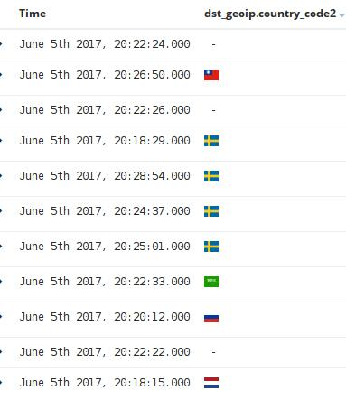

# Country flag FieldFormat Plugin for Kibana 5 

### About
This is a plugin for Kibana5+. Has been developed and tested on Kibana 5.2.0 version. The plugin uses [flag-icon-css](https://github.com/lipis/flag-icon-css)



### Usage
Installation steps:
```
$ cd KIBANA_HOME/plugins
$ git clone https://github.com/nabilbendafi/country-flag-fieldformatters.git country-flag-fieldformatters
$ cd country-flag-fieldformatters
$ npm install
```
or 
```
$ bin/kibana plugin --install nabilbendafi/country-flag-fieldformatters
```

Unistall:
```
$ bin/kibana plugin --remove country-flag-fieldformatters
```

### Screenshots


### Contributions
Anyone is welcome to contribute to my project. There are various ways you can contribute:

1. Open an [Issue](https://github.com/nabilbendafi/country-flag-fieldformatters/issues) on GitHub
2. Send me a Pull Request with your bug fixes and/or new features
3. Contact via email: **nabil@bendafi.fr**
